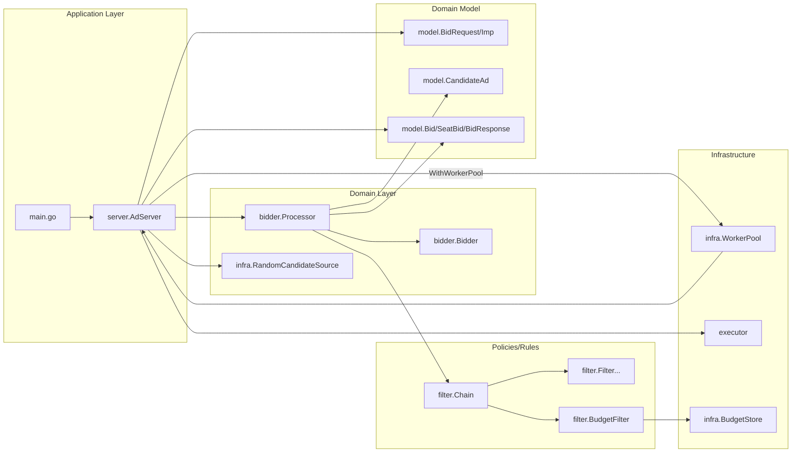

# Architecture

Status: Implemented (matches current codebase)

This repository is a demo ad-request (bid request) processing pipeline. By responsibility, it can be viewed as:

- Application service: `server` (request orchestration, concurrency scheduling, response assembly)
- Domain service: `bidder` (single-candidate processing, filtering, bidding)
- Policies/rules: `filter` (filter chain, budget, individual filters)
- Domain model: `model` (request/response and intermediate objects)

## Module relationships

## Layer notes

- `server`: orchestration + aggregation only. It uses an Executor to fan out candidate fetch and candidate evaluation tasks, then finalizes bids per `Imp`; optionally caps in-flight requests via `MaxConcurrentRequests` with admission mode (reject|block).
- `bidder`: implements single-candidate processing (`ProcessCandidate`) and calls `filter.Chain` + `Bidder`.
- `filter`: executes filters sequentially via `Chain.Apply`; budget check reads from `infra.BudgetStore`. Budget deduction is applied during finalization.
- `model`: pure data structures plus small domain helpers (e.g. `CandidateAd.PassesFloor`).
