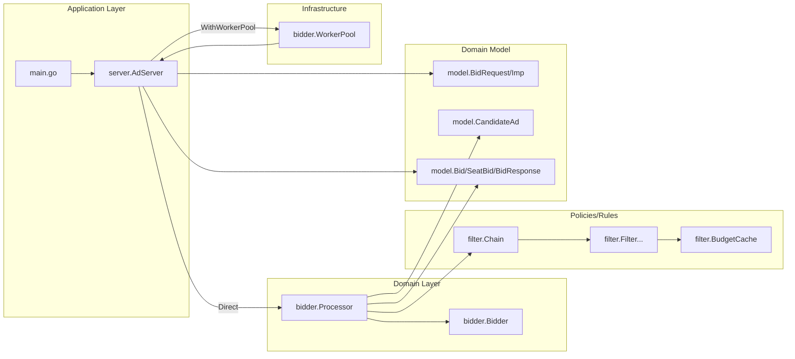

# Architecture

This repository is a demo ad-request (bid request) processing pipeline. By responsibility, it can be viewed as:

- Application service: `server` (request orchestration, concurrency scheduling, response assembly)
- Domain service: `bidder` (candidate processing, filtering, bidding, concurrency limiting)
- Policies/rules: `filter` (filter chain, budget, individual filters)
- Domain model: `model` (request/response and intermediate objects)

## Module relationships

## Layer notes

- `server`: orchestration + aggregation only. For each `Imp`, it calls `processor.ProcessImp`, selects top-N bids, then assembles `BidResponse`.
- `bidder`: generates candidates (random simulation in this demo), runs `filter.Chain`, calls `Bidder` for bidding, and limits candidate concurrency via `semaphore`.
- `filter`: executes filters sequentially via `Chain.Apply`; budget is simulated via `BudgetCache` deduction.
- `model`: pure data structures plus small domain helpers (e.g. `CandidateAd.PassesFloor`).

