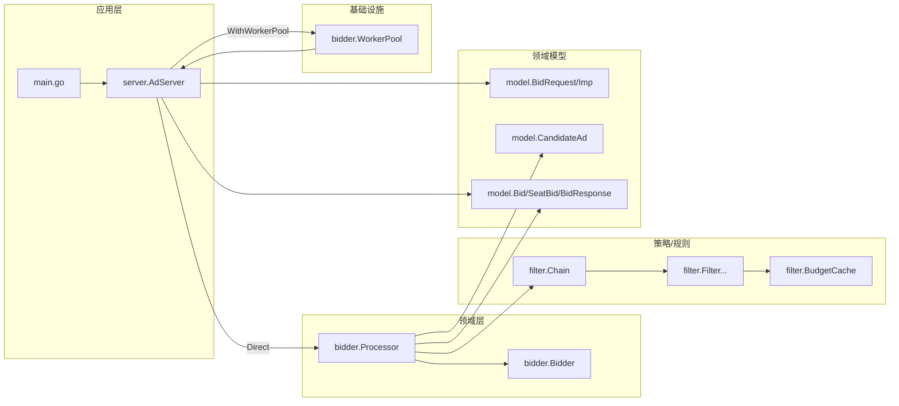

# 架构图

本工程是一个广告竞价请求（ad request）处理链路示例，按职责可分为：

- 应用服务：`server`（请求编排、并发调度、响应组装）
- 领域服务：`bidder`（候选处理、过滤、出价、并发限流）
- 策略/规则：`filter`（过滤链、预算、各类过滤器）
- 领域模型：`model`（请求/响应/中间对象）

## 模块关系

## 分层说明

- `server`：只做“调度 + 聚合”，对每个 `Imp` 调用 `processor.ProcessImp` 并选 TopN 后组装 `BidResponse`。
- `bidder`：负责候选生成（示例为随机模拟）、调用 `filter.Chain`、调用 `Bidder` 出价，并通过 `semaphore` 控制候选并发度。
- `filter`：通过 `Chain.Apply` 串行执行一组过滤器；预算通过 `BudgetCache` 扣减模拟。
- `model`：纯数据结构与简单领域方法（如 `CandidateAd.PassesFloor`）。

