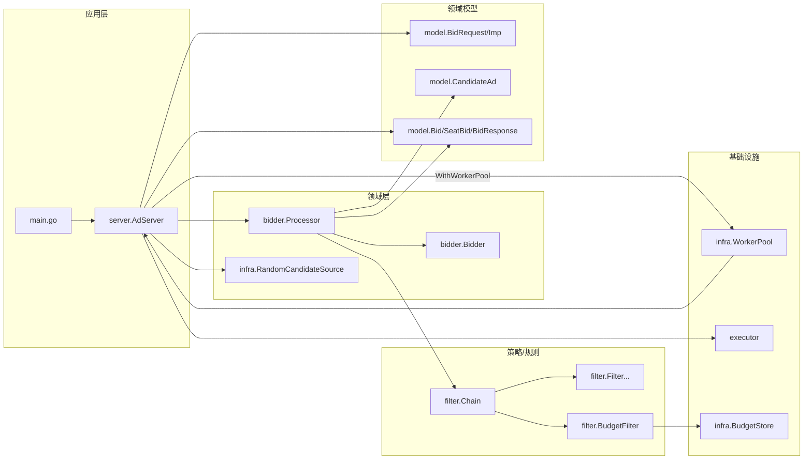

# 架构图

本工程是一个广告竞价请求（ad request）处理链路示例，按职责可分为：

- 应用服务：`server`（请求编排、并发调度、响应组装）
- 领域服务：`bidder`（单候选处理、过滤、出价）
- 策略/规则：`filter`（过滤链、预算、各类过滤器）
- 领域模型：`model`（请求/响应/中间对象）

## 模块关系

## 分层说明

- `server`：只做“调度 + 聚合”，通过 Executor 扁平化并发地拉取候选与评估候选，最后对每个 `Imp` 做结果收敛与 Finalize。
- `bidder`：实现单候选处理（`ProcessCandidate`），调用 `filter.Chain` + `Bidder` 完成过滤与出价。
- `filter`：通过 `Chain.Apply` 串行执行过滤器；预算检查读取 `infra.BudgetStore`，预算扣减在 Finalize 阶段执行。
- `model`：纯数据结构与简单领域方法（如 `CandidateAd.PassesFloor`）。
