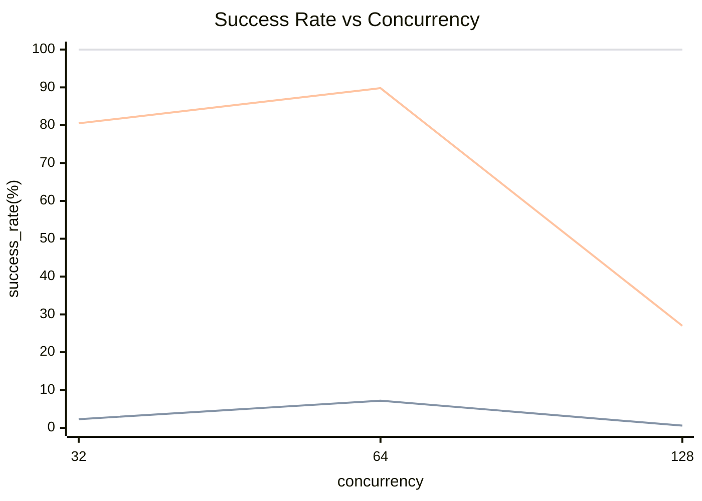
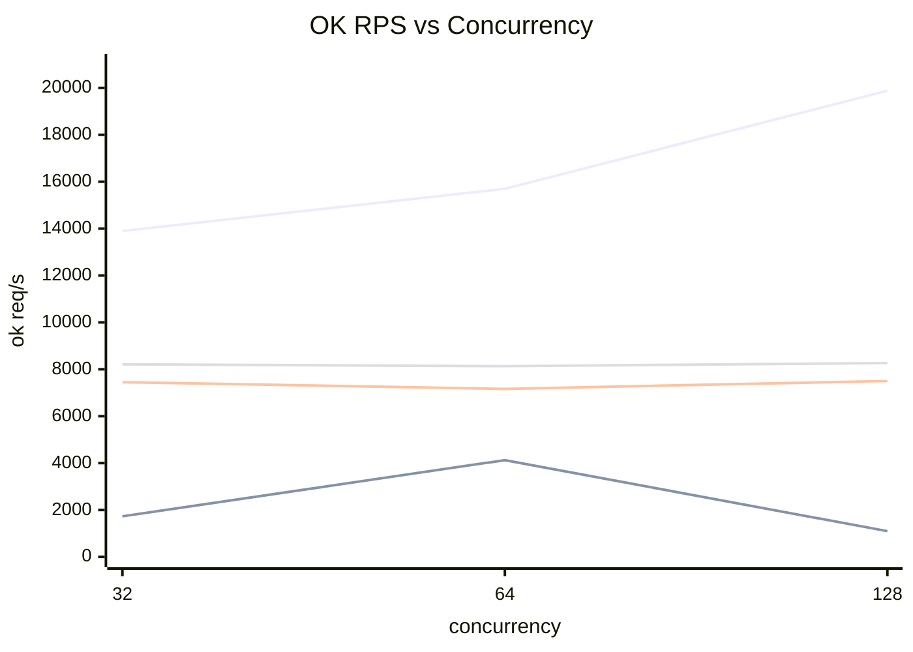
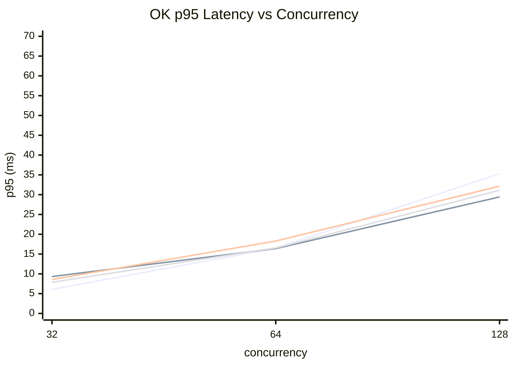

# Loadtest 结果（Markdown + Mermaid）

环境：
- goos: darwin
- goarch: arm64

## 运行命令

Direct（sweep）：

```bash
go run ./cmd/loadtest -mode=direct -sweep -duration=1s -imps=6 -cands=40 -concurrency-list=32,64,128
```

WorkerPool（sweep）：

```bash
go run ./cmd/loadtest -mode=pool -sweep -duration=1s -imps=6 -cands=40 -concurrency-list=32,64,128 -pool-workers-list=16 -pool-queue-list=64,1024,64k
```

## 相关参数（与当前代码一致）

- `-sweep`：输出 CSV + 两类“曲线点”汇总（success_rate_curve / throughput_latency_line）
- `-pool-workers[-list]` / `-pool-queue[-list]`：WorkerPool 的 worker 数与队列容量（支持 `64k` 单位）
- `-max-requests`：请求级别最大并发在途数（0 关闭）
- `-admission=reject|block`：`max-requests` 开启时的策略（快速拒绝或排队等待直到超时）
- `-work-iters` / `-work-us`：为每个 candidate 注入 CPU/睡眠负载，用于构造 CPU-bound 或 latency-bound 场景

## 原始输出

### Direct

```
mode,concurrency,pool_workers,pool_queue,attempted_rps,ok_rps,success_rate,p50_ms,p95_ms,p99_ms,latency_samples,elapsed_ms
direct,32,0,0,13895,13895,1.000000,1.711,6.071,8.480,13906,1000
direct,64,0,0,15698,15698,1.000000,1.175,16.496,24.301,15723,1001
direct,128,0,0,19879,19879,1.000000,1.563,35.285,58.193,19916,1001
```

### WorkerPool

```
mode,concurrency,pool_workers,pool_queue,attempted_rps,ok_rps,success_rate,p50_ms,p95_ms,p99_ms,latency_samples,elapsed_ms
pool,32,16,64,75175,1731,0.023021,3.828,9.314,12.414,1735,1002
pool,64,16,64,57435,4125,0.071820,7.032,16.385,21.018,4141,1003
pool,128,16,64,183179,1099,0.005997,11.931,29.422,37.613,1103,1004
pool,32,16,1024,9256,7450,0.804873,3.887,8.567,11.600,7466,1002
pool,64,16,1024,7976,7164,0.898153,8.144,18.291,23.300,7196,1004
pool,128,16,1024,27827,7500,0.269534,15.261,32.151,40.082,7565,1008
pool,32,16,65536,8215,8215,1.000000,3.616,7.873,9.845,8232,1002
pool,64,16,65536,8133,8133,1.000000,7.216,16.547,20.864,8171,1004
pool,128,16,65536,8265,8265,1.000000,14.419,31.094,41.581,8338,1008
```

## 汇总表

### Success Rate（业务成功率）

| mode | workers | queue | concurrency=32 | concurrency=64 | concurrency=128 |
|---|---:|---:|---:|---:|---:|
| direct | - | - | 100.0% | 100.0% | 100.0% |
| pool | 16 | 64 | 2.3% | 7.2% | 0.6% |
| pool | 16 | 1024 | 80.5% | 89.8% | 27.0% |
| pool | 16 | 65536 | 100.0% | 100.0% | 100.0% |

### OK Throughput（成功请求吞吐，ok req/s）

| mode | workers | queue | concurrency=32 | concurrency=64 | concurrency=128 |
|---|---:|---:|---:|---:|---:|
| direct | - | - | 13895 | 15698 | 19879 |
| pool | 16 | 64 | 1731 | 4125 | 1099 |
| pool | 16 | 1024 | 7450 | 7164 | 7500 |
| pool | 16 | 65536 | 8215 | 8133 | 8265 |

### OK Latency（成功请求延迟，p95 ms）

| mode | workers | queue | concurrency=32 | concurrency=64 | concurrency=128 |
|---|---:|---:|---:|---:|---:|
| direct | - | - | 6.071 | 16.496 | 35.285 |
| pool | 16 | 64 | 9.314 | 16.385 | 29.422 |
| pool | 16 | 1024 | 8.567 | 18.291 | 32.151 |
| pool | 16 | 65536 | 7.873 | 16.547 | 31.094 |

## Mermaid 曲线

### 业务成功率曲线（Success Rate vs Concurrency）



### 吞吐-并发折线（OK RPS vs Concurrency）



### 延迟-并发折线（OK p95 Latency vs Concurrency）



## 快速解读（基于本次样本）

- Direct 在本次参数下成功率始终 100%，且 ok req/s 随并发提升；但 p95 尾延迟随着并发上升明显增大。
- WorkerPool 的“硬上限/背压”很明显：queue 小时成功率显著下降；queue 足够大时成功率可到 100%，但 ok req/s 更接近受 worker 数限制的水平。
