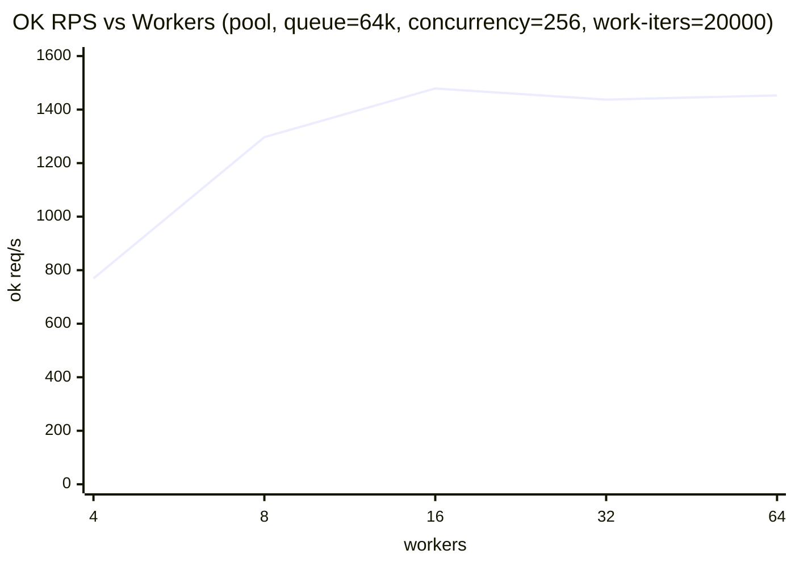
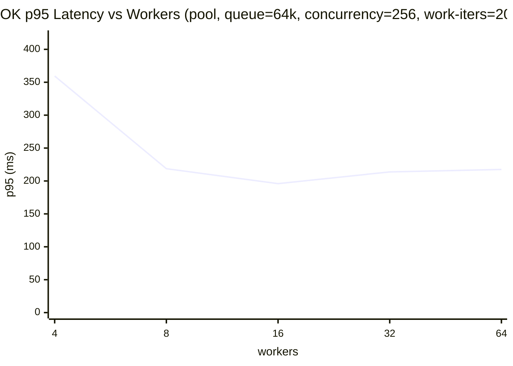

# Worker 数量对吞吐的影响（证明 worker 是瓶颈）

## 目的

在 WorkerPool 模式下，固定足够大的 queue（避免拒绝/排队成为主要瓶颈），同时给每个 candidate 增加 CPU 计算负载，使系统进入 CPU-bound 状态，观察 ok 吞吐是否随 worker 数提升而提升（直至饱和）。

## 运行命令

```bash
go run ./cmd/loadtest \
  -mode=pool -sweep -duration=2s \
  -imps=6 -cands=40 \
  -work-iters=20000 \
  -concurrency-list=256 \
  -pool-queue-list=64k \
  -pool-workers-list=4,8,16,32,64
```

## 原始输出（CSV）

```
mode,concurrency,pool_workers,pool_queue,attempted_rps,ok_rps,success_rate,p50_ms,p95_ms,p99_ms,latency_samples,elapsed_ms
pool,256,4,65536,769,769,1.000000,326.470,359.465,383.909,1777,2312
pool,256,8,65536,1297,1297,1.000000,193.690,218.620,241.144,2842,2190
pool,256,16,65536,1479,1479,1.000000,170.308,195.948,220.243,3214,2172
pool,256,32,65536,1437,1437,1.000000,170.568,213.794,229.139,3094,2152
pool,256,64,65536,1453,1453,1.000000,170.405,217.510,245.696,3122,2148
```

## 汇总表

| workers | queue | concurrency | ok req/s | success_rate | p95 (ms) | p99 (ms) |
|---:|---:|---:|---:|---:|---:|---:|
| 4 | 65536 | 256 | 769 | 100.0% | 359.465 | 383.909 |
| 8 | 65536 | 256 | 1297 | 100.0% | 218.620 | 241.144 |
| 16 | 65536 | 256 | 1479 | 100.0% | 195.948 | 220.243 |
| 32 | 65536 | 256 | 1437 | 100.0% | 213.794 | 229.139 |
| 64 | 65536 | 256 | 1453 | 100.0% | 217.510 | 245.696 |

## Mermaid 曲线

### OK 吞吐随 worker 变化（OK RPS vs Workers）



### OK p95 延迟随 worker 变化（p95 vs Workers）



## 结论（基于本次样本）

- 在 queue 足够大、success_rate=100% 的前提下，ok 吞吐从 4→8→16 workers 明显提升（769→1297→1479 req/s），说明 worker 执行能力是主要瓶颈之一。
- 继续提升到 32/64 workers 后吞吐不再提升（甚至略降），说明瓶颈开始转移到其它因素（CPU 总核数上限、调度/同步开销、提交路径争用等）。
