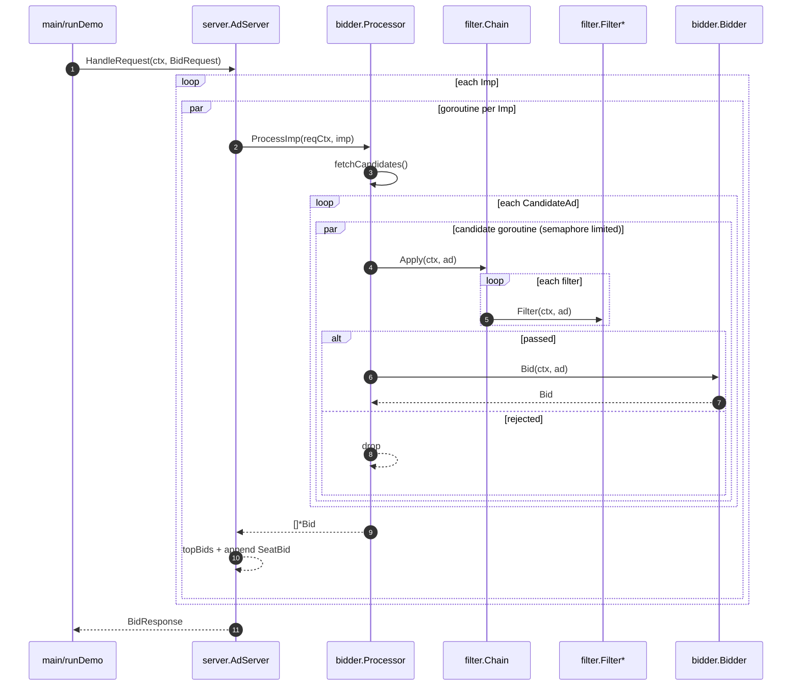
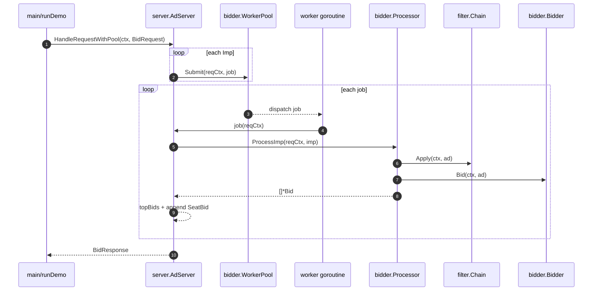

# Sequence

This repository demonstrates two processing modes:

- Direct: one goroutine per `Imp`; inside each `Imp`, candidates are processed concurrently (limited by a `semaphore`)
- WorkerPool: each `Imp` is wrapped as a job submitted to `WorkerPool` and executed by fixed workers; inside each job, candidates are still processed concurrently

## Direct Processing

## Worker Pool Processing

