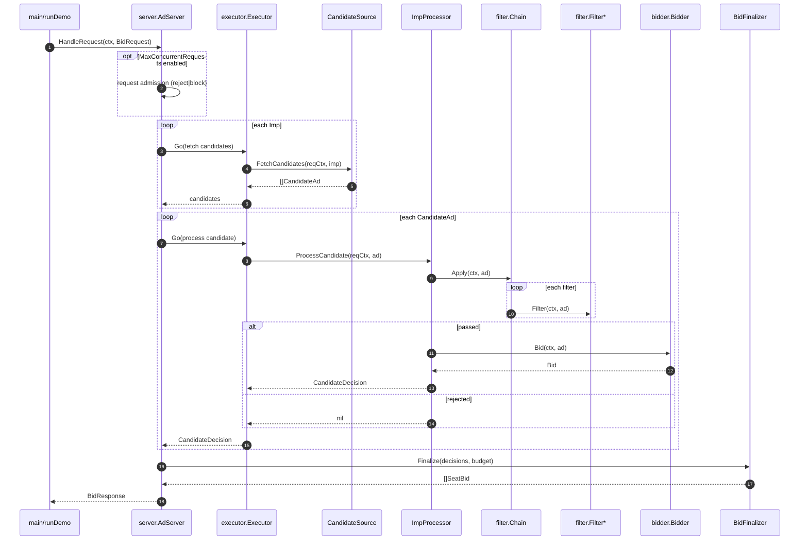
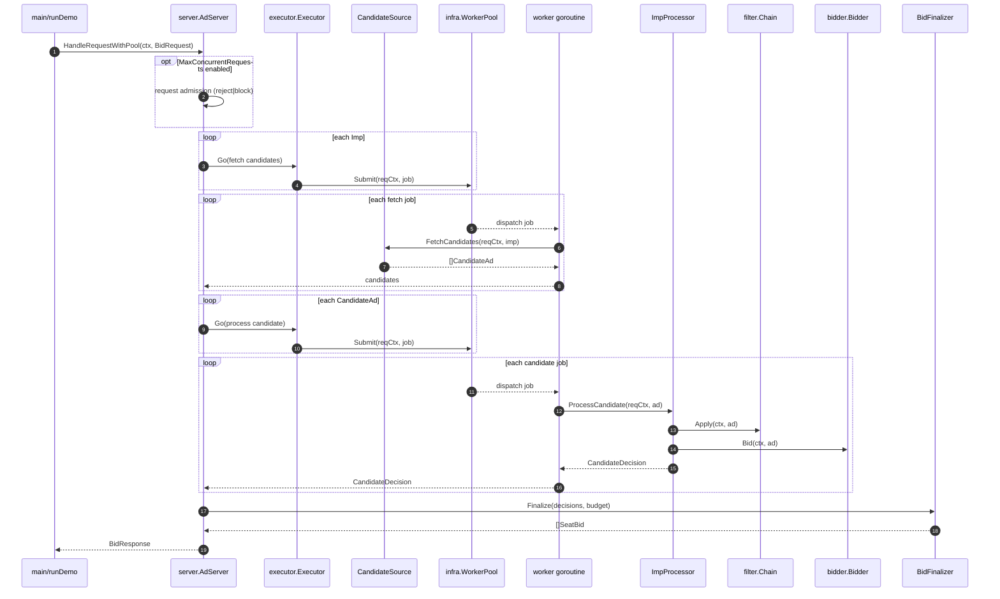

# Sequence

This repository demonstrates two processing modes:

- Direct: `server.AdServer` uses an Executor to fan out tasks (bounded concurrency) for `Imp` candidate fetch and candidate evaluation; business logic stays synchronous per-task
- WorkerPool: same orchestration model, but the Executor submits tasks to a bounded `WorkerPool`

## Direct Processing

## Worker Pool Processing

