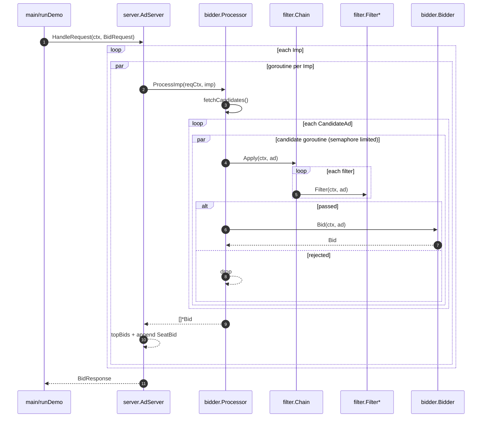
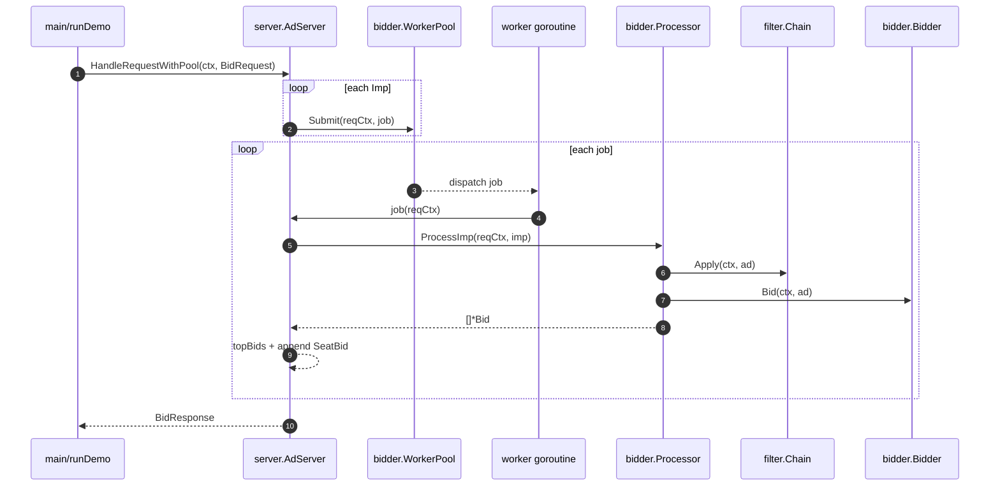

# 时序图

本工程演示两种处理模式：

- Direct：请求内对每个 `Imp` 起 goroutine；imp 内部对候选并发（受 `semaphore` 限制）
- WorkerPool：将每个 `Imp` 封装为 job 提交到 `WorkerPool`，由固定 worker 执行；job 内部同样会触发候选并发

## Direct Processing

## Worker Pool Processing

